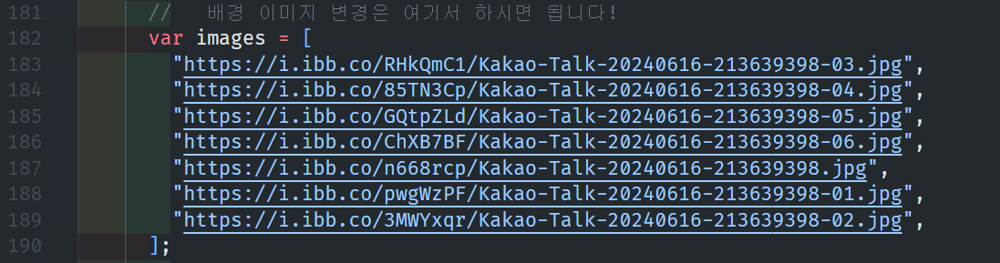
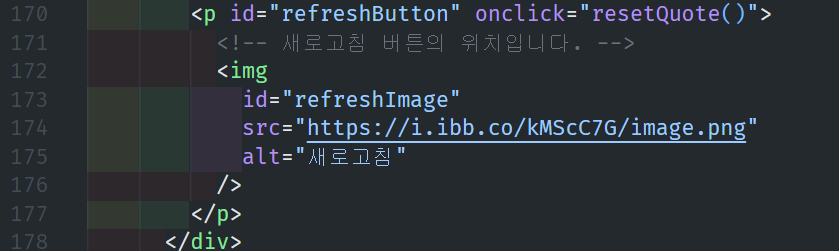
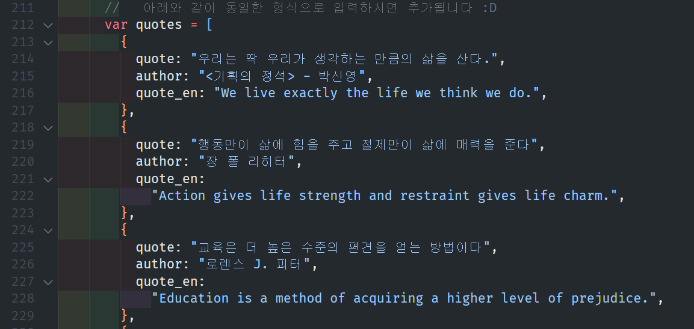

# Notion Custom Widget
Notion 커스텀 위젯 만들기!

## Update
[syjin412](https://blog.naver.com/syjin412) 님의 요청으로 새로운 버전을 만들어 보았습니다.

1. index.html에 모든 코드를 수정하여 [apption.co](https://apption.co/)에 Copy-Paste하면 사진과 명언을 변경할 수 있도록 변경
2. 파스텔 색상으로 배경 변경
3. 새로고침 버튼 변경
4. 명언에 영어 추가
5. [G마켓 산스](https://noonnu.cc/font_page/366)로 폰트 변경

## Korean-Quotes (한국어 명언 위젯)  

###### 위젯 링크 : https://notion-custom-widget.vercel.app/ (original) / https://apption.co/embeds/b2fc23e9 (pastel_cusom)
###### 개발 후기: [벨로그](https://velog.io/@unbroken2650/ncw-korean-quotes)

Stack : HTML / CSS / Javascript  

### 노션에 임베드 하는 방법 
1. <code>/embed</code> 작성 후 **Embed** 클릭  

2. Embed Link에 링크 입력  
https://notion-custom-widget.vercel.app/  

3. 끝!  

### 배경 이미지, 새로고침 버튼, 명언 목록을 변경하는 법
1. 원하는 이미지를 [이미지 업로드 사이트](https://ko.imgbb.com/)에 업로드한다.
#### 배경 이미지
2. 이미지의 링크를 아래의 목록에 추가한다.

#### 새로고침 버튼
2. 이미지의 링크를 아래 src 안에 있는 url과 대체한다.

#### 명언 목록
3. 명언을 추가하실 때도 아래 형식과 동일하게 수정하여 입력하시면 됩니다.
